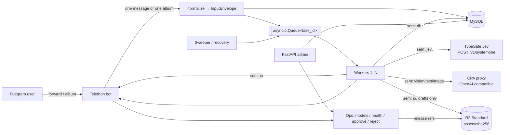

# Architecture

## Goals and non-goals

**Goals:** help a human operator turn forwarded Telegram content into original, useful
English X posts for the US market. The system triages the content cheaply, adds context,
writes a strong but honest hook, prepares compliant images, and leaves the final decision to
the operator. It also stays inside the Cloudflare R2 free tier.

**Non-goals for the MVP:** auto-posting to X, video processing, and multi-tenant use. The
operator approves each draft and posts it by hand. Publishing can be added later as an adapter
behind `Ops.approve`.

## Components and responsibilities

| Component | Responsibility | Never does |
|---|---|---|
| **Jev** (TypeSafe AI System One API) | Fast typed triage: value score, content type, and probabilities that a post is promotional, risky, unverified, or has useful media | Write text or look at images |
| **Main LLM** (via the CPA proxy, OpenAI-compatible) | Deep editorial evaluation and the rewrite | Make final routing decisions on its own |
| **Vision model** (via CPA) | Per-image analysis: type, watermark, text language, quality, relevance | — |
| **Image model** (Image2-compatible, via CPA) | Enhance or localize the operator's own visuals, and create new original visuals | Remove watermarks or touch third-party photos |
| **MySQL** | Task state, settings, X rules, hooks, model registry, timeline, and asset references (the source of truth) | Hold media bytes |
| **R2** (Standard storage) | Persisted assets for drafts only, content-addressed | Hold incoming or rejected media |

## Prior art and what we borrowed

| Project | Strength we borrowed | What we avoided |
|---|---|---|
| Telegram relay / repost bots (`NightlyNexus/Twitter-to-Telegram-Reposter`, `GeiserX/telegram-delay-channel-cloner`) | Batching message groups | Reposting the same text and media as-is |
| `ma2za/telegram-llm-bot` | Object storage plus readiness checks | Storing every upload |
| `garyb9/twitter-llm-bot` | Async queue-driven generation | Fully automatic posting |
| TypeSafe docs: confidence-gated routing pattern | Act on a classifier only above a confidence floor; escalate otherwise | Treating one threshold as universal |
| CLIProxyAPI issue tracker | `/images/edits` is not always routed for GPT Image models, so the transport is configurable | Hard-coding a single image endpoint |

## Component diagram



Everything runs in **one process and one event loop**: uvicorn, the FastAPI lifespan, Telethon,
the workers, and the sweeper. That gives one deploy unit, one log stream, and one shutdown path.

## Data flow (one task)

1. **Intake.** Each regular message from an allowed user becomes its own task, even if
   several unrelated forwards arrive at the same moment. A Telegram album (one `grouped_id`,
   delivered by Telethon as `events.Album`) is the only automatic grouping.
2. **Normalize.** `normalize()` builds an `InputEnvelope`: deduplicated text, URLs, a media
   *descriptor* list, forward origins, and the locale and market. No media is downloaded yet.
3. **Persist and enqueue.** A `tasks` row is written (`received`) and its `task_id` goes on
   the `asyncio.Queue`. MySQL is the source of truth; the queue only carries IDs.
   - Before any work starts, the worker **claims** the task atomically:
     `UPDATE tasks SET status='processing', claimed_by=… WHERE id=… AND status='received'`.
   - Only the worker that gets `affected_rows == 1` processes the task. This holds across
     workers and across processes.
4. **Worker** (`pipeline/processor.py`):
   1. **Triage with Jev** (`pipeline/triage.py`). This is text only, and nothing has been
      downloaded yet.
      - The state is a JSON object holding the post text, source, links, an attachment
        *description*, and the target audience.
      - The typed questions live in `prompts/<locale>/jev_triage.json`:
        `value` (score, 4 levels), `content_type` (choice), and `promotional`, `risky`,
        `unverified`, `media_useful` (nouls).
      - Routing rules:
        - Skip when `promotional ≥ promo_skip`.
        - Skip when *confident* (`confidence ≥ confidence_floor`) and `value < min_value`.
        - Skip when the content type is confidently `promo` or `chat`.
        - Mark for review when `risky` or `unverified ≥ risk_review`.
        - Otherwise proceed. If Jev's confidence is below the floor, the task is
          **escalated** and the main LLM's evaluation decides suitability.
      - If the post has fewer than 20 characters of text, Jev is not called; the vision and
        LLM steps decide.
      - **Jev is optional.** The task proceeds as `escalated`, with a warning logged and
        recorded on the task timeline, and the main LLM decides, in any of these cases:
        - `JEV__ENABLED=false`;
        - the API key is missing;
        - Jev returns any error;
        - the call exceeds `JEV__BUDGET_SECONDS`, which includes retries.

        A Jev outage never fails a task.
      - Skipped tasks cost one Jev call and **store nothing**.
   2. **Media.** Images are downloaded from Telegram **into memory**. Downloads are skipped
      if Jev judged the media not useful. A failed download marks the affected images REVIEW
      with the reason, and the text pipeline continues. Each image is checked with Pillow and its
      `source_sha256` is recorded. If the same file appeared in another task, the draft gets a
      warning.
   3. **Vision**, one call per image in parallel. One failing image goes to review; the task
      continues.
   4. **Evaluate.** The main LLM acts as an editor: key facts from the source, allowed
      background, risks, the angle, and whether the content is suitable. If it is not
      suitable, the task is skipped and nothing is stored.
   5. **Rewrite.** The main LLM writes JSON, then deterministic guards check it.
      - Blocking *problems* (fabricated numbers, clickbait, too close to the source, and so
        on) are retried with the problems as feedback.
      - *Review items* do not trigger retries. These are `background` claims the LLM added,
        and numbers backed only by LLM-extracted facts. They force `needs_review`.
   6. **Images.** The policy decides keep, enhance, regenerate, or review. Outputs are
      produced and optimized **in memory**.
      - Every image-model output (enhance, localize, regenerate) must then pass **visual
        QC** (`pipeline/image_qc.py`, prompt `image_qc.md`).
      - The vision model compares the candidate with the reference image (enhance and
        localize) or with the allowed facts (regenerate). It checks text, numbers, dates,
        product and brand names, people, watermarks and logos, and facts.
      - A deterministic check also requires every number rendered in the image to appear in
        the reference text.
      - Any failed check, reported issue, or QC error makes the image REVIEW.
   7. **Persist** (the only step that writes to R2). It uploads final assets plus, if
      enabled, compressed review copies. Uploads are deduplicated and budget-checked. **Any**
      storage error (budget, R2 failure) downgrades that image to REVIEW with the reason; the
      draft is still saved.
   8. The draft is saved and the bot delivers it. The status is:
      - `draft_ready` when there are no problems and no review items;
      - `needs_review` otherwise.

      If assets cannot be fetched from R2 or sent to Telegram, the text and review card are
      still sent. The downloaded bytes are dropped when the task ends.
5. **Operator actions.**
   - **Approve** works on `draft_ready`, or on `needs_review` when there are no blocking
     problems (the "approve (reviewed)" button). The task becomes `approved`. Review copies
     are deleted, and so are final assets unless `STORAGE__RETAIN_APPROVED_ASSETS=true`; they
     were already delivered to Telegram with the draft.
   - **Reject:** the task becomes `rejected` and all its assets are released.
   - **Regenerate:** all assets are released and the task is re-queued. Media is fetched
     again from Telegram.

### Task state machine

```
received → processing → draft_ready → approved
                      ↘ needs_review ↗ (regenerate) → received
                      ↘ skipped / failed → (regenerate) → received
any non-final → rejected
```

## Jev integration details

- The client is `clients/jev.py`. It uses Bearer auth against
  `https://api.typesafe.ai/v1` and has two calls:
  - `GET /models` returns `[{name, description, release_date}]`.
  - `POST /systemone` sends `{model, state, questions}` and returns
    `{model, answers{id: {type, noul|choice|score, probabilities, legend, confidence}}, usage}`.
- Answer semantics:
  - A **score** ranges over `0..n-1`, weighted by probability. It is normalized to `0..1`.
  - **Choice** and **score** answers carry a `confidence` value in `0..1`.
  - A **noul** answer has no confidence; its probability is the signal.
- Retries use exponential backoff on 429 and 529 (Overloaded), plus the usual 5xx and
  transport errors. A 422 is a bug in our query and is not retried.
- Limits from the docs: 64k tokens per request (32k for the state plus the longest question),
  80 requests/s, and text only. Jev is English-first, so other languages, including CJK, have
  lower accuracy. That lowers confidence, which escalates the task to the LLM instead of
  skipping it. This matters because many Telegram sources are not in English.
- The API key comes **only** from the `JEV__API_KEY` environment variable. It is held as a
  `SecretStr`, never stored in MySQL, never editable in the admin UI (which only shows
  whether it is set), and its value is registered with the log masker.

## Storage policy (R2 free tier: 10 GB-month Standard storage)

| Content | Where it lives | Lifetime |
|---|---|---|
| Incoming Telegram media | Process memory only, during the task. **No temp files and no R2.** | Until the task ends |
| Media of skipped, unsuitable, or failed tasks | Nowhere (only metadata and hashes in MySQL) | — |
| Final assets: kept, enhanced, or generated images (QC passed) | R2 `assets/<sha[:2]>/<sha256>.<ext>`, Standard class | Until approve (unless `STORAGE__RETAIN_APPROVED_ASSETS=true`), reject, or regenerate |
| Review copies, compressed (`STORAGE__PERSIST_REVIEW_MEDIA`, **off by default**) | R2, same keying; for a QC failure, the rejected candidate | Deleted on approve, reject, or regenerate |

- **Deduplication.** Keys are SHA-256 hashes of the *optimized* bytes. If MySQL already
  references a key, the upload is skipped; otherwise a HEAD request guards against orphans.
  An object is deleted only when no `task_media.asset_key` references it any more.
- **Compression** (`pipeline/media.py`):
  - Screenshots, charts, and other flat-color images stay **lossless PNG**, with the long
    side capped at 4096 px, so text stays crisp.
  - Photos become progressive JPEG at quality 85, with the long side capped at 2048 px.
  - Telegram's already-compressed JPEG photos within the limit are kept byte-for-byte, which
    avoids generational loss.
  - EXIF orientation is applied and metadata, including GPS, is stripped.
  - If re-encoding would not make a file smaller, the original is kept.
- **Budget.** `STORAGE__BUDGET_BYTES` (default 9 GiB) is checked against tracked usage before
  each upload. Over budget, the image is flagged for review instead of being stored. The
  dashboard and the health check show current usage.
- **Retention.** Retry leftovers from an interrupted run are released at the start of the
  next attempt.

## Concurrency model

| Semaphore | Guards | Default |
|---|---|---|
| `jev` | TypeSafe System One calls | 4 |
| `text` | evaluation and rewrite calls | 2 |
| `vision` | per-image analysis | 2 |
| `image` | image edit and generation | 1 |
| `db` | concurrent PyMySQL threads (`asyncio.to_thread`) | 5 |
| `io` | Telegram downloads and R2 transfers | 4 |

PyMySQL is synchronous, and a connection must never be shared between threads.
`asyncio.to_thread` may run consecutive calls on different executor threads. So every
operation goes through `Database.run()`, which takes the `db` semaphore and makes **one**
`to_thread` call that opens a connection, runs the operation, and closes the connection, all
in the same thread. Nothing is pooled.

This is the simplest safe model. The connect cost of about 1–3 ms on localhost is negligible
at MVP volume. A thread-confined pool can replace it later behind the same async API.

## Reliability

- **Retries** use jittered exponential backoff and honor `Retry-After`. If the LLM returns
  invalid JSON, it gets one "repair" turn.
- **Timeouts** are set per client, and each whole task is capped by
  `pipeline.task_timeout_seconds`.
- **Error isolation.** A worker marks a failing task `failed` and releases any assets it
  stored. Image failures are isolated per image.
- **Optional dependencies degrade, they don't fail.** A Jev failure falls back to the
  LLM. Telegram media, image model, QC, and R2 failures turn the affected images into REVIEW,
  and the text draft is still delivered.
- **Atomic claims.** Only a conditional `UPDATE … WHERE status='received'` that affects
  exactly one row lets a worker run a task. `claimed_by` and `claimed_at` record the owner
  and the lease.
- **Graceful shutdown.**
  1. Workers drain within the grace period while Telegram is still connected.
  2. Cancelled tasks **release their claim** (back to `received`) for the next start.
  3. Telegram disconnects, then HTTP and DB are closed.
- **Crash recovery.** Every 60s the sweeper resets `processing` tasks whose claim is older
  than `task_timeout_seconds + 120s` back to `received`, then enqueues all `received` tasks.

## Content and image policy (enforced in code)

- Rewrites must add value. The guards check:
  - the model's self-reported `is_mere_translation`;
  - similarity to the source;
  - that every number appears in the source, the approved facts, or text extracted from the
    images;
  - banned clickbait phrases, hashtag and emoji limits, and all-caps shouting.

  Each claim the LLM writes is labelled:
  - **`source`:** stated in the source.
  - **`background`:** a factual statement the LLM added. It is unverified, so it **requires
    human review** before approval, not just a warning.
  - **`opinion`:** an explanation or analysis that asserts no new fact. It is allowed
    without review.

  Numbers backed only by LLM-extracted facts, not by the source text or image text, also
  require review.
- `image_policy.decide()`:

  | Situation | Decision |
  |---|---|
  | Sensitive content | review |
  | Third-party watermark | review (never removed) |
  | Third-party real-event photo or real people | review (re-creating it would fabricate a news image) |
  | Other third-party visuals | regenerate as an original, without using the source as a reference |
  | Own visual with text in another language | localize |
  | Own low-quality visual | enhance |
  | Own good media | keep |

## i18n design

- Locale packs live in `i18n/locales/<code>.json` and hold the UI strings, `language_name`,
  and `language_tag`.
- Prompts live in `prompts/<code>/`. That includes `jev_triage.json`, so Jev's questions can
  be localized too. Missing files fall back to en-US.
- The `x_rules`, `hooks`, and `locales` tables are keyed by locale and market, and each task
  carries its own locale and market.
- Image prompts always include `language_name`, so text rendered in images follows the
  configured language.

## Reliability review changes

- Jev is optional, with a time budget and fallback to the main LLM.
- Media, R2, image-model, and QC failures are non-fatal and downgrade the image to REVIEW.
- Visual QC is mandatory for every image-model output.
- PyMySQL: one connection per operation, confined to one thread (the old shared pool could
  hand a connection to different executor threads).
- The merge-window collector is removed. Unrelated forwards are separate tasks; only albums
  are grouped.
- API keys are env-only and never stored in MySQL (`sql/003_reliability.sql` cleans up old
  rows).
- LLM background facts require review. The "approve (reviewed)" path covers non-blocking
  review items.
- Atomic MySQL task claims with a lease, release on cancel, and stale-claim requeue.
- R2: review copies are off by default, and approved final assets are released unless
  retention is enabled.

## Simplifications made during review

- Jev is a native System One client. The old design faked it as an OpenAI chat endpoint that
  silently fell back to CPA; that fallback is gone.
- Triage now happens before any download, so skipped posts cost one Jev call and no
  bandwidth.
- The "raw upload at ingest" step is gone. Raw media used to be uploaded to R2 so retries
  could re-read it; retries now re-fetch from Telegram, which still holds the original.
- The separate `raw_key` and `processed_key` columns are replaced by a single `asset_*`
  reference per media item. Deduplication and release logic live in one place,
  `services/storage.py`.
